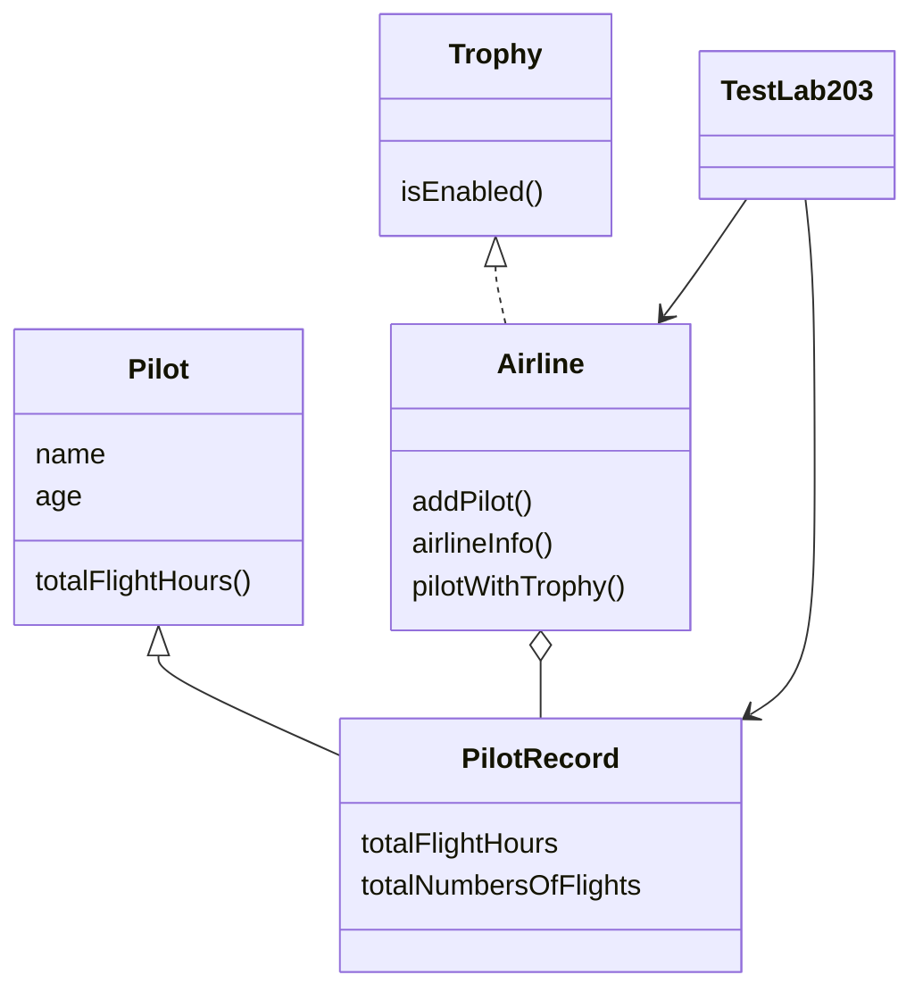

# Airline Pilot Manager

**A small Java console application that models pilot records and flight-count achievements.**

[Run the demo](#quick-start) · [Class design](#architecture) · [Recorded output](docs/demo-output.txt)

## Project story

**Problem.** Represent an airline's pilots, flight hours, and flight counts in a simple object-oriented program.

**Approach.** Separate the abstract pilot identity from the concrete flight record, collect records in an airline, and express achievement eligibility through the `Trophy` interface.

**Current result.** An interactive console program that accepts pilot records, prints the airline roster, and lists pilots with at least 1,200 flights. It is an educational OOP exercise with in-memory data.

## Quick start

Requires a JDK with `javac` and `java` available on your path. No external dependencies or build tool are needed.

```sh
git clone https://github.com/abdulrhmanG-alahmadi/Airline-Pilot-Management-System.git
cd Airline-Pilot-Management-System
javac *.java
java TestLab203
```

Enter an airline name, pilot name, age, flight hours, and number of flights. Answer `Yes` to add another pilot or `No` to print the results. Airline and pilot names must be single words because the program uses `Scanner.next()`.

## Demo

Use `DemoAir`, `Alex`, `30`, `2500`, `1200`, and `No` at the prompts. The verified run includes:

```text
Airline Name: DemoAir Airline
Pilot{name=Alex, age=30}
Flight Record{total Flight Hours =2500, total Numbers of Flights=1200}
Trophy: Platinum membership in class "A" hotels
```

[View the complete recorded console output](docs/demo-output.txt).

## Architecture



## What this demonstrates

Inheritance · abstract classes · interfaces · collections · console input · method overriding

## Scope and limitations

Records last only for the current run. Input assumes valid numbers, names are single tokens, and there is no persistence or operational airline integration. Achievement recognition is the exercise's flight-count rule, not a real certification or airline policy.
